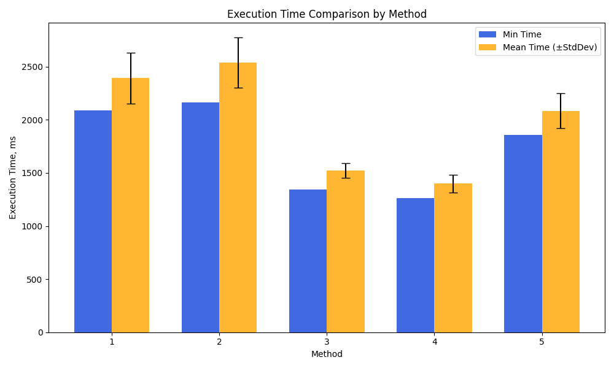
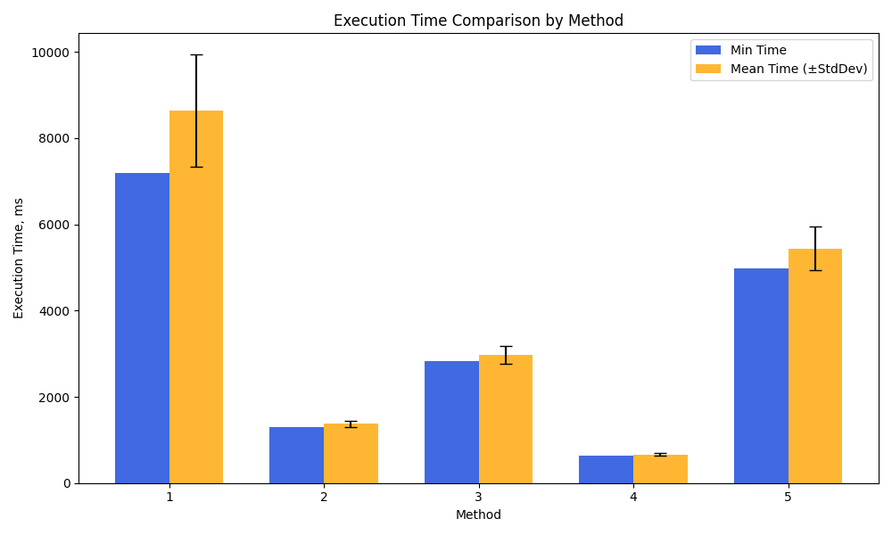

<mark>Template for your README. Remove all unused parts and instructions</mark>

# Lab work <mark>NUMBER</mark>: <mark>SHORT TOPIC</mark>
Authors (team):  <mark>Orest Chupa - https://github.com/ratatuiii</mark>  <mark>Nazar Dizhak - https://github.com/NazarDizhak</mark>  <mark>Kostiantyn Stetsiuk - https://github.com/f1rset</mark> 
Variant: <mark>none</mark>
## Prerequisites

<mark>g++, cmake, python3. list of required libraries for python in requirements.txt</mark>

### Compilation

<mark>run ./compile.sh in root folder</mark>

### Installation

<mark>just clone the repository</mark>

### Usage

<mark>In /scripts run the program1_runner or program2_runner. You will get statistics of each method (min time, mean time, deviation) into  your terminal, separated with a "\n" inbetween.</mark>  
<mark> Here is how to these programs: </mark>  
For program1 - "python3 program1_runner.py <datafile> <runs> <clear_cache> <output_csv>"

For program2 - "python3 program2_runner.py <datafile> <runs> <output_csv>"

<mark>Also, running these programs will result in creating the statistics of these runs in the data folder. It can be further used by compute_graph.py to create a graph that would be saved in the same folder for later use of your choice</mark>

### Important!

<mark>compute_graph.py is very prinitive, so any path and name changes of the output have to be changed manually inside the code itself</mark>

### Results

<h2>Program 1 results</h2>
<mark>1. Standard C++ idiom (while(filestream >> word))</mark>  
This method reads word by word directly from the file stream, which introduces frequent I/O operations. It’s no surprise that it’s the slowest (min: 2037 ms, mean: 2175.8 ms). Each read incurs some overhead, making it inefficient for large files

<mark>2. Reading the entire file into a std::stringstream first</mark>  
This method avoids frequent disk I/O and speeds things up by ~100ms (min: 2164 ms, mean: 2236.2 ms), though it’s still not the best. The overhead from stringstream operations likely keeps it from performing better.

<mark>3. Reading the entire file into memory as a string, then splitting</mark>  
This one is even faster (min: 1349 ms, mean: 1402.7 ms). It avoids stringstream overhead and works directly with a std::string, making splitting much more efficient. Predictable improvement.

<mark>4. Optimized large-file approach (minimal copying)</mark>  
This gets even better, although within possible deviation from the previous method (min: 1266 ms, mean: 1342.3 ms). The reduction in unnecessary memory allocations and copying helps a lot. The difference compared to the previous method isn't massive, but it’s noticeable.

<mark>5. Using stream iterators for large files (Bad idea #1)</mark>  
Surprisingly, this isn't as fast as expected (min: 1862 ms, mean: 1995.5 ms). While stream iterators might seem efficient, they can introduce unexpected overhead due to the way they handle input iterators. This could explain why it's slower than methods 3 and 4. Not really disappointing, considering it was named "bad idea".

Here is the graph to visualize the results:

<h2>Program 2 results</h2>

# Additional tasks
<mark>IF APPLICABLE, LIST ALL THE EXTRA FEATURES YOU ADDED. PROVIDE DETAILS<mark>

# ATTENTION!
  
Additional tasks not listed in the previous paragraph would not be graded.

Be sure to provide a complete list of authors.

